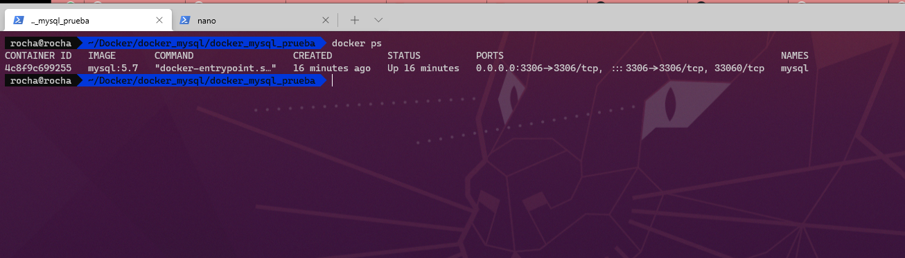

# CONTENEDOR CON MYSQL:5.7

Ejemplo practico de contenedor con MySQL 5.7

## PUERTO EXPUESTO
Por defecto el puerto es:

`PORT: 3356`

## COMANDOS
Ejecutar contenedor

`docker-compose up -d`

## SALIDA DEL CONTENEDOR

